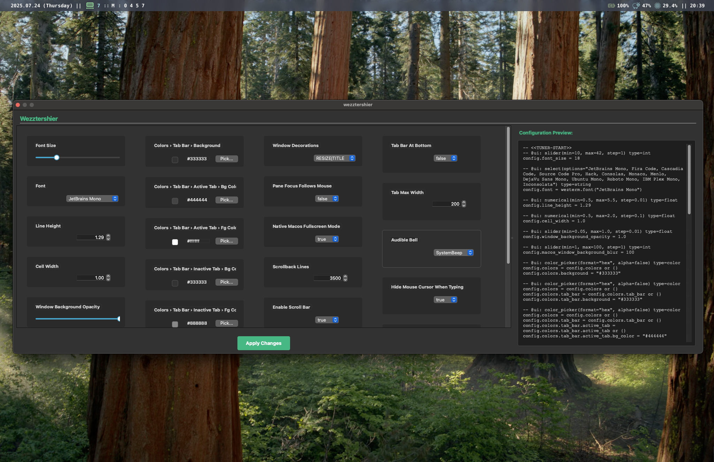

# wezztershier
(noun) : gui from decoration  

## wezztershier decoration grammar
\<decorator_line>  ::= "-- @ui:" <annotation>  
\<annotation>      ::= <ui_type> [ "(" <param_list> ")" ] { <trailing_param> }  
\<ui_type>         ::= <identifier>  
\<param_list>      ::= <param> { "," <param> }  
\<trailing_param>  ::= <identifier> "=" <value> [ "," ]  
\<param>           ::= <identifier> "=" <value>  
\<value>           ::= <number> | <string> | <identifier> | <boolean> | <list> | <dict>  
\<list>            ::= "[" [ <value> { "," <value> } ] "]"  
\<dict>            ::= "{" [ <pair> { "," <pair> } ] "}"  
\<pair>            ::= <identifier> ":" <value>  
\<boolean>         ::= "true" | "false"  
\<identifier>      ::= letter { letter | digit | "_" }  
\<number>          ::= digit { digit } [ "." digit { digit } ]  
\<string>          ::= "\"" { any character except unescaped "\"" } "\""  

### what is this?
This is a language for generating gui's from decorations added to wezterm config. 
Here is an example of a gui and the config section that generated it:


```
-- <<TUNER-START>>
-- @ui: slider(min=10, max=42, step=1) type=int
config.font_size = 18
-- @ui: select(options="JetBrains Mono, Fira Code, Cascadia Code, Source Code Pro") type=string
config.font = wezterm.font("JetBrains Mono")
-- @ui: numerical(min=0.5, max=5.5, step=0.01) type=float
config.line_height = 1.29
-- @ui: numerical(min=0.5, max=2.0, step=0.1) type=float
config.cell_width = 1.0
-- @ui: slider(min=0.05, max=1.0, step=0.01) type=float
config.window_background_opacity = 1.0
-- @ui: slider(min=1, max=100, step=1) type=int
config.macos_window_background_blur = 100
-- @ui: color_picker(format="hex", alpha=false) type=color
config.colors = config.colors or {}
config.colors.background = "#333333"

-- @ui: color_picker(format="hex", alpha=false) type=color
config.colors = config.colors or {}
config.colors.tab_bar = config.colors.tab_bar or {}
config.colors.tab_bar.background = "#333333"

-- @ui: color_picker(format="hex", alpha=false) type=color
config.colors = config.colors or {}
config.colors.tab_bar = config.colors.tab_bar or {}
config.colors.tab_bar.active_tab = config.colors.tab_bar.active_tab or {}
config.colors.tab_bar.active_tab.bg_color = "#444444"

-- @ui: color_picker(format="hex", alpha=false) type=color
config.colors = config.colors or {}
config.colors.tab_bar = config.colors.tab_bar or {}
config.colors.tab_bar.active_tab = config.colors.tab_bar.active_tab or {}
config.colors.tab_bar.active_tab.fg_color = "#ffffff"

-- @ui: color_picker(format="hex", alpha=false) type=color
config.colors = config.colors or {}
config.colors.tab_bar = config.colors.tab_bar or {}
config.colors.tab_bar.inactive_tab = config.colors.tab_bar.inactive_tab or {}
config.colors.tab_bar.inactive_tab.bg_color = "#333333"

-- @ui: color_picker(format="hex", alpha=false) type=color
config.colors = config.colors or {}
config.colors.tab_bar = config.colors.tab_bar or {}
config.colors.tab_bar.inactive_tab = config.colors.tab_bar.inactive_tab or {}
config.colors.tab_bar.inactive_tab.fg_color = "#888888"

-- @ui: slider(min=0, max=2000, step=100) type=int
config.cursor_blink_rate = 500
-- @ui: select(options="true, false") type=string
config.hide_tab_bar_if_only_one_tab = true
-- @ui: select(options="NONE, RESIZE, TITLE, RESIZE|TITLE") type=string
config.window_decorations = "RESIZE|TITLE"
-- @ui: select(options="true, false") type=string
config.pane_focus_follows_mouse = false
-- @ui: select(options="true, false") type=string
config.native_macos_fullscreen_mode = true
-- @ui: numerical(min=100, max=10000, step=100) type=int
config.scrollback_lines = 3500
-- @ui: select(options="true, false") type=string
config.enable_scroll_bar = true
-- @ui: slider(min=1, max=60, step=1) type=int
config.animation_fps = 60
-- @ui: slider(min=1, max=120, step=1) type=int
config.max_fps = 60
-- @ui: select(options="true, false") type=string
config.tab_bar_at_bottom = false
-- @ui: numerical(min=50, max=500, step=10) type=int
config.tab_max_width = 200
-- @ui: select(options="SystemBeep, Disabled") type=string
config.audible_bell = "SystemBeep"
-- @ui: select(options="true, false") type=string
config.hide_mouse_cursor_when_typing = true
-- @ui: select(options="true, false") type=string
config.swallow_mouse_click_on_window_focus = false
-- @ui: select(options="true, false") type=string
config.debug_key_events = false
-- <<TUNER-END>>
```